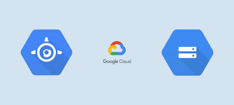
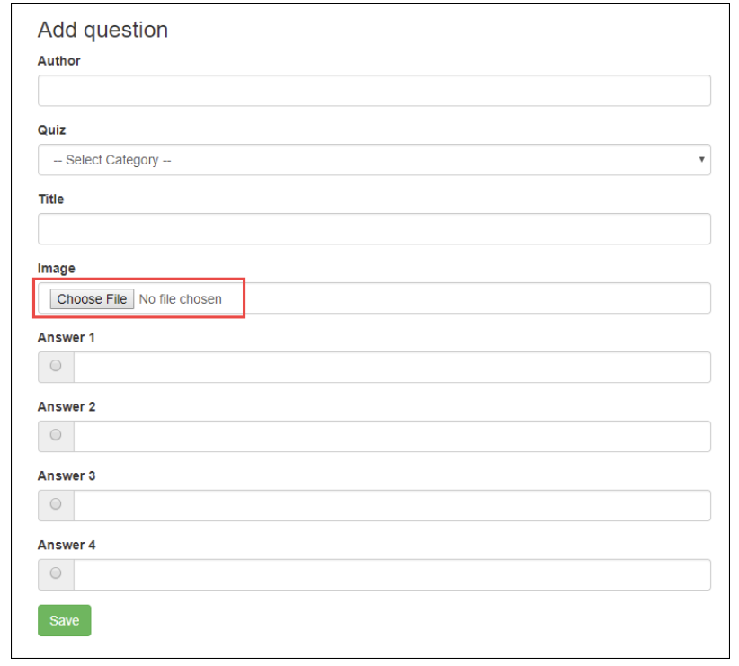

<h1 align="center">App Dev: Storing Image and Video Files in Cloud Storage<project-name></h1>
 

   
 
  

<project-description>

## Description 
In this project we created a Quiz App Engine application using Python, created a script to configure the application and created a Cloud Storage bucket to store/deploy the application.

## Screenshots

## Built With

- Google Cloud Storage
- Python
- Google Cloud CLI
- Google Cloud Code Editor
- App Engine
- Datastore

## Contributors

**Harold Garner**,
**Iman Crooks**

## 🤝 Support

Contributions, issues, and feature requests are welcome!

Give a ⭐️ if you like this project!
